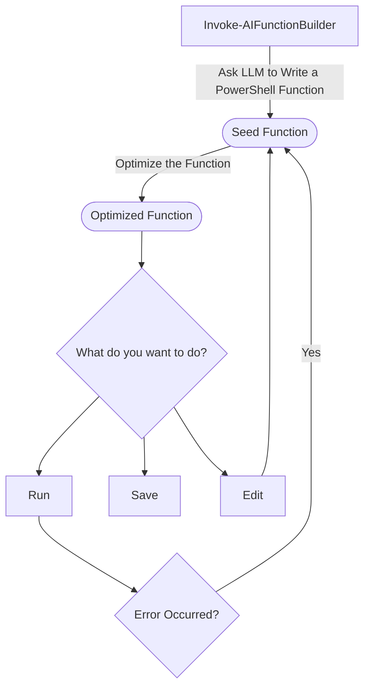
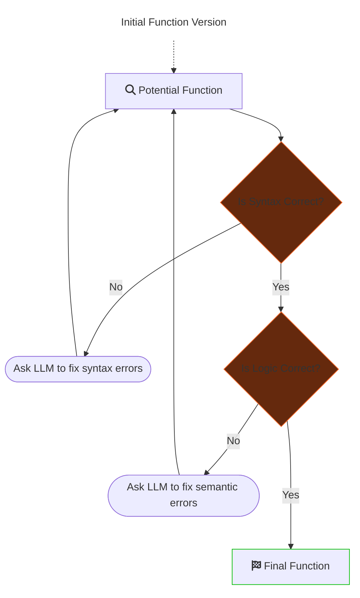

# AIFunctionBuilder

AIFunctionBuilder takes a prompt and generates a PowerShell function which is validated for syntax and logical issues so you don't have to do the boring work.

To launch the function builder just enter the command `Invoke-AIFunctionBuilder` with no parameters, the video below demonstrates most of the current features.

https://user-images.githubusercontent.com/13159458/230610955-c37ad3e8-f12c-4802-83d5-20ed550f4a2c.mp4   

## Usage

To launch the function builder interactively:
```pwsh
Invoke-AIFunctionBuilder
```
To edit an existing function provide the text and a prompt that would be used to create it, the builder will correct any issues and validate it meets the prompt requirements:
```pwsh
Invoke-AIFunctionBuilder -InitialFunction "function Say-Hello { Write-Host 'hello' }" -Prompt "Write a powershell function that will say hello"
```

The function builder is designed to run interactively so you can see the work the LLM is doing but if you want to you can run the function builder non-interactively with the `-NonInteractive` switch:
```pwsh
"Write a powershell function that will list all available wifi networks" | Invoke-AIFunctionBuilder -NonInteractive
```

## Background

Hi I'm [@shaun_lawrie](https://twitter.com/shaun_lawrie) and I've spent a bit of time spent going back-and-forth between ChatGPT and other LLM tooling to validate any output that's more complicated than a one-liner.

The approach I've built here is an experiment that uses an automated feedback loop to iterate on the initial script the LLM produces so I don't have to muck around fixing the obvious issues. By utilizing [PSScriptAnalyzer](https://github.com/PowerShell/PSScriptAnalyzer) and the PowerShell Abstract Syntax Tree (AST) to parse the script and check for the common signs of hallucination the script can be validated to a degree that should provide much better reliability on the first execution.  

The script is not executed until the user reviews it because blindly executing code can cause some damage (think: write me a script to clean up space on my harddrive).

I chose to focus this solution on "functions" instead of PowerShell code in a general sense because they're relatively easy to reason about, they generally take parameters and return values. Realistically this is producing a single-function module but as seen in the video above it can also produce multi-function modules occasionally.

## Solution

The function builder starts with `Invoke-AIFunctionBuilder` which generates an initial version of the function and then optimizes it and asks the user what to do with the output. The optimize logic is detailed below because it's fairly hefty.



## Optimize the Function
This is the heaviest bit of complexity which is where the seed function is validated in a loop with both the syntax and semantics being checked until they're both correct. Originally the code corrections were being performed by [Codex](https://openai.com/blog/openai-codex) but OpenAI discontinued the model, I still stand by this model performing much better for targeted code editing but I had to update it to use the chat endpoints.

The syntax checks have been put together using the AST inside this module but these would probably be a good candidate for [custom PSScriptAnalyzer rules](https://learn.microsoft.com/en-us/powershell/utility-modules/psscriptanalyzer/create-custom-rule?view=ps-modules).  

`Optimize-AifbFunction` in [FunctionBuilderCore](/Private/FunctionBuilderCore.ps1)  


### 🔶 Is Syntax Correct?
The initial version of the function builder checks the following during the syntax checking stage:  
 - Basic script parsing validates the syntax for things like missing parentheses, brackets, unclosed strings etc.
 - Checks commands are available.
  - If not it checks on PSGallery if any modules have it and asks if you want to install a module or try another command.
 - Checks for parameters used in the script that the commandlet doesn't accept.
 - Checks for any unnamed parameters and asks the LLM to always used named params because they're less ambiguous and easier to validate.
 - Checks for named parameters being used multiple times.
 - Checks that at least one parameter set is satisfied by the parameters provided to the commandlet by the LLM.
 - Checks if types used by New-Object/Add-Type are real and resolvable.
 - Checks that any .NET static methods used exist and have the correct number of parameters passed to them.
 - Checks that any .NET constructors have the correct number of parameters passed to them.
 - Checks that any .NET static properties used exist.

### 🔶 Is Logic Correct?
The semantic check simply asks the LLM "given the prompt {A} does the function {B} meet all requirements?" and if not it is asked to rewrite it to fix any issues.

## Notes
> **Warning**
> - Sometimes the builder can get stuck in a loop because it tries to fix something then breaks it over and over, try to be clearer in the prompt, discourage the feature that's being painful or raise an issue.
> - Sometimes PSScriptAnalyzer rules can be too restricting, you can suggest exclusions to add in [`/Private/FunctionBuilderParser.ps1`](/Private/FunctionBuilderParser.ps1)
