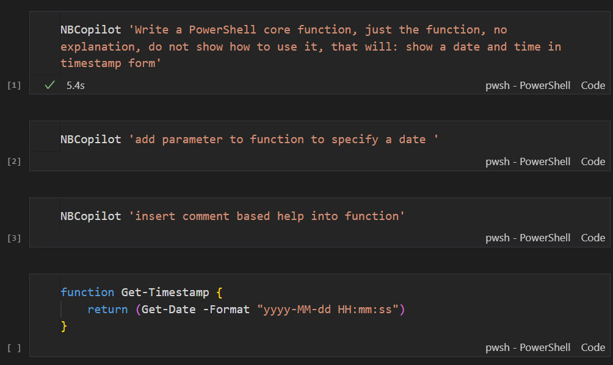

# NBCopilot - ChatGPT + Polyglot Interactive Notebook 

This PowerShell function allows you to use ChatGPT directly from your Interactive Notebook.

# Demo

Check it out. If you like it, please give it a thumbs up, subscribe and hit the notification for future videos.

# The Notebook

The first cell interacts with the ChatGPT API with that prompt and inserts GPT's response at the end, as you can see, the last cell.

