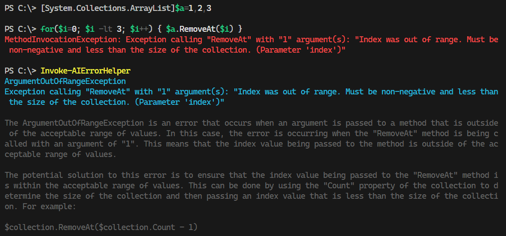

<strong><p align="center">OpenAI at your Fingertips! ✨</p></strong>
<strong><p align="center">using PowerShell</p></strong>

<p align="center">
  <a href="https://github.com/codespaces/new?hide_repo_select=true&ref=main&repo=588124439&machine=standardLinux32gb&devcontainer_path=.devcontainer%2Fdevcontainer.json&location=East">
     
  </a>
  <br/>
  <br/>
  <!-- <a href="https://twitter.com/dfinke">
    
  </a> -->
  <!-- https://img.shields.io/twitter/follow/dfinke.svg?style=social&label=Follow%20%40dfinke -->
  <a href="https://x.com/dfinke">
    
  </a>
  <a href="https://youtube.com/@dougfinke">
    
  </a>  
  <a href="https://www.powershellgallery.com/packages/PowerShellAI/">
    
  </a>  
  <a href="https://www.powershellgallery.com/packages/PowerShellAI/">
    
  </a>
  <!-- <a href="https://github.com/dfinke/PSAdvantage/blob/master/LICENSE">
    
  </a> -->
</p> 

<p align="center">
   • <a href="https://github.com/dfinke/PowerShellAI/wiki">Documentation</a> •
</p>

# **Big Announcement**
- I created a new module called [PowerShellAIAssistant](https://github.com/dfinke/PowerShellAIAssistant).
- You can get it: `Install-Module -Name PowerShellAIAssistant`
- Highly recommend you check it out.

> You can just type 'ai "your question here"' and it will return an answer.

> The module exposes a lot of handy functions that interact directly with the new Assistants API, so you can also build scripts or spin up and manage different assistants/threads yourself.

```
The Assistants API is a tool that lets you create your own AI assistants in your applications. 
Think of it as building a digital helper that can follow instructions and use different tools and knowledge to answer questions or solve problems. 

It has three types of tools for different tasks like coding, information retrieval, and executing specific functions. 

OpenAI is adding more, and you'll also be able to add your own tools to customize your assistant's abilities.
```

> All can programmatically automate via PowerShell.

# PowerShellAI

## A User-Friendly Module for OpenAI's GPT-3 and DALL-E API

`PowerShellAI` is a ***community-maintained*** PowerShell module designed to simplify the use of OpenAI's GPT-3 language model and DALL-E API. It empowers users to effortlessly build complex language-powered applications, regardless of their level of experience.

`PowerShellAI` is cross-platform and runs seamlessly on Windows, Linux, and MacOS.

Getting started with `PowerShellAI` is easy. Simply install the module from the gallery using the following command: 

`Install-Module -Name PowerShellAI`

The repository includes a comprehensive list of functions that enable users to interact with GPT-3 and DALL-E, along with examples of how to use them at the command line or in scripts. 

The video demos showcase the many possibilities of the module and how you can leverage its functions to best suit your needs.

Whether you're a seasoned developer or just getting started with AI, `PowerShellAI` is a valuable tool that can help you unlock the full potential of OpenAI's GPT-3 and DALL-E.

<br/>
<br/>

>

# Unleash the Power of Artificial Intelligence with PowerShell
Welcome to the PowerShell Artificial Intelligence repository! Here, you will find a collection of powerful PowerShell scripts that will enable you to easily integrate AI into your projects and take them to the next level. Imagine being able to interact directly with OpenAI's GPT AI with just a few simple commands. With this module, it's now possible.

## Get Ahead of the Game
By using this module, you'll have the ability to add cutting-edge AI functionality to your projects without needing to have a deep understanding of the underlying technology. This means you can stay focused on what you do best while still being able to work with the latest and greatest.

## Start Your AI Journey Today

### Installation

In the PowerShell console:

```powershell
Install-Module -Name PowerShellAI
```

Get/Create your OpenAI API key from [ https://platform.openai.com/account/api-keys]( https://platform.openai.com/account/api-keys) and then set as *secure string* with `Set-OpenAIKey` or as *plain text* with `$env:OpenAIKey`.

## Examples
Check out these PowerShell scripts to see how easy it is to get started with AI in PowerShell:

|PS Script | Description | Location
|--|--|--|
| ai | Experimental AI function that you can pipe all sorts of things into and get back a completion | [ai.ps1](./Public/ai.ps1)
| copilot | Makes the request to GPT, parses the response and displays it in a box and then prompts the user to run the code or not. | [copilot.ps1](./Public/copilot.ps1)
| Get-GPT3Completion - alias `gpt` | Get a completion from the OpenAI GPT-3 API | [Get-GPT3Completion.ps1](./Public/Get-GPT3Completion.ps1)
| Invoke-AIErrorHelper | Helper function let ChatGPT add more info about errors | [Invoke-AIErrorHelper.ps1](./Public/Invoke-AIErrorHelper.ps1)
| Invoke-AIExplain | Utilizes the OpenAI GPT-3 API to offer explanations for the most recently run command, and more. | [Invoke-AIExplain.ps1](./Public/Invoke-AIExplain.ps1)
| Get-OpenAIEdit | Given a prompt and an instruction, the model will return an edited version of the prompt | [Get-OpenAIEdit.ps1](./Public/Get-OpenAIEdit.ps1)
| Get-DalleImage | Get an image from the OpenAI DALL-E API | [Get-DalleImage.ps1](./Public/Get-DalleImage.ps1)
| Get-AOAIDalleImage | Get an image from the Azure OpenAI DALL-E API | [Get-AOAIDalleImage.ps1](./Public/Get-AOAIDalleImage.ps1)
| Set-DalleImageAsWallpaper | Set the image from the OpenAI DALL-E API as the wallpaper | [Set-DalleImageAsWallpaper.ps1](./Public/Set-DalleImageAsWallpaper.ps1)
| Get-OpenAIUsage |Returns a billing summary of OpenAI API usage for your organization
| Disable-AIShortCutKey | Disable the <kbd>ctrl+g</kbd> shortcut key go getting completions | [Disable-AIShortCutKey.ps1](./Public/Disable-AIShortCutKey.ps1) |
| Enable-AIShortCutKey | Enable the <kbd>ctrl+g</kbd> | [Enable-AIShortCutKey.ps1](./Public/Enable-AIShortCutKey.ps1) |


## Polyglot Interactive Notebooks

| Notebook | Description | Location
|--|--|--|
| OpenAI Settings | A notebook shows how to get OpenAI dashboard info | [Settings.ipynb](CommunityContributions/05-Settings/Settings.ipynb)

<br/>

## Demos of the PowerShellAI

Here are some videos of `PowerShellAI` in action:

| Description | YouTube Video |
|--|--|
| Quick Demo of PowerShellAI | <a href="https://youtu.be/fpq9TDpaCuU"> |
| Using PowerShell with OpenAI GPT in the console with a shortcut key | <a href="https://youtu.be/Y2fJki6r4mI"> |
| PowerShell AI - `copilot` at the command line | <a href="https://youtu.be/JrNBvEm6E7Q"> |
| PowerShell AI - new `ai` function | <a href="https://youtu.be/-mlkUVUPZHU"> |
| New-Spreadsheet script: PowerShell + ChatGPT + Excel | <a href="https://youtu.be/Aehsgtll1CA"> |
| Invoke-AIErrorHelper: Lets ChatGPT provide additional information and context about errors | <a href="https://youtu.be/uwDAcIiXqz0"> |
| Invoke-AIExplain: Utilizes the OpenAI GPT-3 API to offer explanations for the most recently run command, and more. | <a href="https://youtu.be/pbwLok0krCQ"> |

<br/>
<br/>

## What it looks like

### Setting AzureOpenAI as the default chat API provider
```powershell
set-chatAPIProvider AzureOpenAI
```

```powershell
# Setting AzureOpenAI parameters
Set-AzureOpenAI -ApiKey 'API Key' -Endpoint https://endpoint.azure-api.net -DeploymentName gpt-35-turbo-16k -ApiVersion 2023-03-15-preview
```

### Setting OpenAI as the default chat API provider
```powershell
Set-ChatAPIProvider OpenAI
```

```powershell
# Fetch 'OpenAIKey' which is stored in the System environment variables
$pass = [Environment]::GetEnvironmentVariable('OpenAIKey', 'Machine')
```

```powershell
# Set 'OpenAIKey'
Set-OpenAIKey -Key ($pass | ConvertTo-SecureString -AsPlainText -Force)
```

***Note:*** One of the above chat API provider has to be set before executing any of the below commands.

> ***Note:*** You can use the `gpt` alias for `Get-GPT3Completion`

```powershell
Get-GPT3Completion "list of planets only names as json"

[
    "Mercury",
    "Venus",
    "Earth",
    "Mars",
    "Jupiter",
    "Saturn",
    "Uranus",
    "Neptune"
]
```

### As XML

```powershell
Get-GPT3Completion "list of planets only names as xml"


<?xml version="1.0" encoding="UTF-8"?>
<planets>
  <planet>Mercury</planet>
  <planet>Venus</planet>
  <planet>Earth</planet>
  <planet>Mars</planet>
  <planet>Jupiter</planet>
  <planet>Saturn</planet>
  <planet>Uranus</planet>
  <planet>Neptune</planet>
</planets>
```

### As Markdown

```powershell

 Get-GPT3Completion "first 5 US presidents and terms as markdown table"


| President | Term |
|----------|------|
| George Washington | 1789-1797 |
| John Adams | 1797-1801 |
| Thomas Jefferson | 1801-1809 |
| James Madison | 1809-1817 |
| James Monroe | 1817-1825 |
```

Copy and pasted into this README.md:

| President | Term |
|----------|------|
| George Washington | 1789-1797 |
| John Adams | 1797-1801 |
| Thomas Jefferson | 1801-1809 |
| James Madison | 1809-1817 |
| James Monroe | 1817-1825 |


## `ai` function

The `ai` function calls that allows `piping` and `prompting` text. This is useful for chaining commands together.

```powershell
ai "list of planets only names as json"
```

```json
[
    "Mercury",
    "Venus",
    "Earth",
    "Mars",
    "Jupiter",
    "Saturn",
    "Uranus",
    "Neptune"
]
```


```powershell
ai "list of planets only names as json" | ai 'convert to  xml'
```

```xml
<?xml version="1.0" encoding="UTF-8"?>
<Planets>
    <Planet>Mercury</Planet>
    <Planet>Venus</Planet>
    <Planet>Earth</Planet>
    <Planet>Mars</Planet>
    <Planet>Jupiter</Planet>
    <Planet>Saturn</Planet>
    <Planet>Uranus</Planet>
    <Planet>Neptune</Planet>
</Planets>
```

```powershell
ai "list of planets only names as json" | ai 'convert to  xml' | ai 'convert to  powershell'
```

```powershell
[xml]$xml = @"
<?xml version="1.0" encoding="UTF-8"?>
<Planets>
    <Planet>Mercury</Planet>
    <Planet>Venus</Planet>
    <Planet>Earth</Planet>
    <Planet>Mars</Planet>
    <Planet>Jupiter</Planet>
    <Planet>Saturn</Planet>
    <Planet>Uranus</Planet>
    <Planet>Neptune</Planet>
</Planets>
"@

$xml.Planets.Planet
```

## Use `ai` with `git`

Pipe the output of `git status` to `ai` to create a commit message.

```powershell
git status | ai "create a detailed git message"
```

```
Commit message:
Added PowerShellAI.psd1, README.md, changelog.md, and Public/ai.ps1 to dcf-spike-piping-to-ai-function branch. Updated PowerShellAI.psd1 and README.md with new changes. Added changelog.md to track changes. Added Public/ai.ps1 to enable piping to AI function.
```

# Copilot at the PowerShell Console

Thank you to [Clem Messerli](https://twitter.com/ClemMesserli/status/1616312238209376260?s=20&t=KknO2iPk3yrQ7x42ZayS7g) for posting a great prompt to show `copilot` in action.


Check out the [video of `copilot` in action]()

# Ask ChatGPT for help with an error message

If you get an error after executing some PowerShell. You can now ask ChatGPT for help. The new `Invoke-AIErrorInsights` function will take the last error message and ask ChatGPT for help.

You can also use the alias `ieh`.



# Code editing example

Unlike completions, edits takes two inputs: the `text` to edit and an `instruction`. Here the `model` is set to `code-davinci-edit-001` because we're working with PowerShell code.

- Here you're passing in the string (`InputText`) that is a PowerShell function.
- The `instruction` is to `add a comment-based help detailed description`

```powershell
Get-OpenAIEdit -InputText @'
function greet {
    param($n)

    "Hello $n"
}
'@ -Instruction 'add comment-based help detailed description'
```

The GPT AI returns:

```powershell
<#
    .SYNOPSIS
        Greet someone
    .DESCRIPTION
        This function greets someone
    .PARAMETER n
        The name of the person to greet
    .EXAMPLE
        greet -n "John"
    .NOTES
        This is a note
#>
function greet {
    param($n)

    "Hello $n"
}
```

# New-Spreadsheet

Creates a new spreadsheet from a prompt

*Note*: This requires the ImportExcel module to be installed

```powershell
Install-Module -Name ImportExcel
```

In action:

```powershell
New-Spreadsheet 'population of india, china, usa, euroupe'
```


Try it out: `New-Spreadsheet "list of first 5 US presidents name, term"`

## Check out the Video

<a href="https://youtu.be/Aehsgtll1CA">

# DALL-E

The [DALL-E](https://openai.com/blog/dall-e/) API is a new API from OpenAI that allows you to generate images from text

Use this function to generate an image from text and set it as your desktop background.

```powershell
Set-DalleImageAsBackground "A picture of a cat"
```

You can also use the `Get-DalleImage` function to get the image and it saves to a temp file, ready to use.

```powershell
Get-DalleImage "A picture of a cat"
```

## Azure OpenAI DALL-E

Azure OpenAI DALL-E provides additional options for text to image generation. Images will by default be put in an Images directory under your script path.

- Use -Images to specify how many images to generate for the same description
- Use -Raw to return the raw image data and not output to a PNG file

```powershell
Get-AOAIDalleImage -Description "a painting of the Sydney Opera house in the style of Rembrant on a sunny day"
```

```powershell
Get-AOAIDalleImage -Description "a painting of the Sydney Opera house in the style of Rembrant on a sunny day" -Images 3
```
